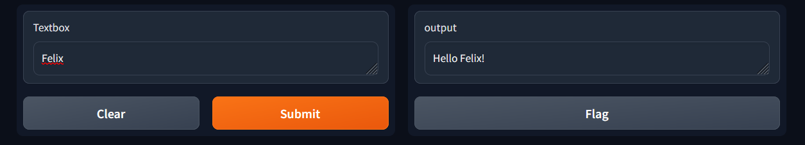
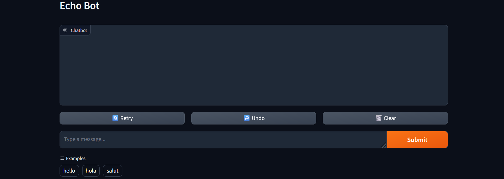

# Gradio
[](https://www.tidyverse.org/lifecycle/#experimental)
[](https://github.com/lgnbhl/gradio/actions/workflows/R-CMD-check.yaml)

**gradio** aims to allow the creation of [Gradio web interfaces](https://www.gradio.app/) directly from R using the <a href="https://rstudio.github.io/reticulate/" target="_blank">reticulate</a> R package under the hood.

## Install

```r
library(remotes)
remotes::install_github("lgnbhl/gradio")
```

Install gradio Python library:

```r
install_gradio()
```

## `Interface()`

Example using the `Interface()` function. Available parameters are listed [here](https://www.gradio.app/docs/gradio/interface).

```r
library(gradio)

greet <- function(name) {
  paste0("Hello ", name, "!")
}

demo <- Interface(fn=greet, inputs="text", outputs="text")
demo$launch()   
```

    Running on local URL:  http://127.0.0.1:7860
    
    To create a public link, set `share=True` in `launch()`.



## `ChatInterface()`

Example using the `ChatInterface()` function. Available parameters are listed [here](https://www.gradio.app/docs/gradio/chatinterface).

```r
library(gradio)

echo <- function(message, history) {
  return(message)
}

demo <- ChatInterface(
  fn = echo, 
  examples = list("hello", "hola", "salut"), 
  title = "Echo Bot"
)
demo$launch()   
```

    Running on local URL:  http://127.0.0.1:7860
    
    To create a public link, set `share=True` in `launch()`.



## TODO

**ANY HELP VERY WELCOMED!**

- run *gradio* with Docker.

Failing to run Gradio chatbot due to error message:
    
    "C stack usage too close to the limit".

See "[data-raw](https://github.com/lgnbhl/gradio/tree/main/data-raw)" folder for reproducible example.

### Dockerfile

```Dockerfile
# reference: https://www.gradio.app/main/guides/deploying-gradio-with-docker
# idea: https://stackoverflow.com/a/73454736

FROM rocker/r-ver:4.1.0

WORKDIR /code
COPY app.R app.R

## Install R packages
RUN R -q -e 'install.packages("remotes")'
RUN R -q -e 'remotes::install_github("rstudio/reticulate")'

# Install gradio
RUN R -q -e 'reticulate::install_miniconda()'
RUN R -q -e 'reticulate::conda_create(envname = "r-gradio", packages = c("python=3.8.13"))'
# RUN R -q -e 'reticulate::conda_list()'
RUN R -q -e 'reticulate::conda_install(envname = "r-gradio", packages = "gradio", pip = TRUE)'

ENV GRADIO_SERVER_NAME="0.0.0.0"

EXPOSE 7860

CMD ["Rscript", "app.R"]
```

### app.R file

```r
library(gradio)
greet <- function(name) {
  return(paste0("Hello, ", name , "!"))
}

demo <- Interface(
  fn=greet,
  inputs= list("text"),
  outputs= list("text"),
)
demo$launch()
```

### Docker commands

```
docker build -t gradio-app-r .
```

```
docker run -p 7860:7860 gradio-app-r
```

    Module(gradio)
    Running on local URL:  http://0.0.0.0:7860
    
    To create a public link, set `share=True` in `launch()`.
    Error: C stack usage is too close to the limit
    Execution halted

**ANY CONTRIBUTION VERY WELCOMED!**

